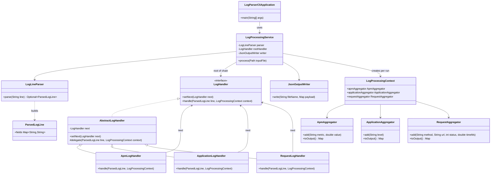

# Part I — Design & Problem Statement

## 1. Describe what problem you’re solving

We need a **command-line tool** that reads a **plain-text log file** (one line per entry). Lines are not all the same “type”: some describe **APM-style metrics** (`metric` + numeric `value`), some are **application events** (`level` + `message`), and some are **HTTP request records** (`request_method`, `request_url`, `response_status`, `response_time_ms`). The tool must **classify** each successfully parsed line into the right category, **aggregate** statistics separately for each category, and **write three JSON files** (`apm.json`, `application.json`, `request.json`). Lines that are **corrupted or not in the supported shape** must be **ignored safely** without crashing. The design should also make it **reasonable to add new log types or formats later** without rewriting the whole program.

---

## 2. What design pattern(s) will be used to solve this?

- **Chain of Responsibility** — Each line is turned into a structured `ParsedLogLine` and passed into a **chain of handlers** (APM → application → request). The **first handler that recognizes** the line processes it; otherwise the line is **delegated** along the chain. After the last handler (`RequestLogHandler`), lines that still do not match have **no successor**, so they are **ignored** (no aggregation). This is the main pattern for **classification**.

- **Separation of concerns** (often described with **Single Responsibility**) — **Parsing**, **classification**, **per-type aggregation**, and **JSON output** live in different classes/packages so each part can change independently.

- **“Strategy-like” aggregation** — Each log family has its own **aggregator** object with different rules (APM: min/median/average/max by metric; application: counts by severity; request: response-time stats and status buckets per route). This behaves like **pluggable aggregation policies** per category.

The **primary pattern** emphasized for classification is **Chain of Responsibility**.

---

## 3. Describe the consequences of using this/these pattern(s)

### Benefits

- **Extensibility:** New handlers (e.g. another log type) can be added to the chain without rewriting the parser’s main loop, as long as rules are well defined.
- **Maintainability:** Classification rules stay **localized** in small classes instead of one large `if / else` block.
- **Testability:** Parser, handlers, aggregators, and end-to-end flows can be tested separately.
- **Safe handling of bad input:** Malformed lines fail at parse time; unrecognized but parseable lines can fall through the chain and be ignored.

### Tradeoffs

- **More classes and wiring** than a single monolithic parser.
- **Handler order matters** — incorrect ordering can misclassify lines (e.g. a handler that is too general runs too early).
- **Format assumptions:** The current parser targets **space-separated `key=value`** lines; arbitrary formats (e.g. standard Apache combined logs) need different parsing or adapters, not only more handlers.

---

## 4. Class diagram — classes and Chain of Responsibility

The diagram shows the **handler chain** (`LogHandler` implementations), parsing, shared context, aggregators, and JSON output.

**Chain of Responsibility flow:** `LogProcessingService` parses each line to a `ParsedLogLine`, then invokes the **root** handler (`ApmLogHandler`). Each handler either **updates** the appropriate aggregator on `LogProcessingContext` or **delegates** to the next handler. The chain **ends** at `RequestLogHandler` (`HandlerChainConfiguration`): if that handler cannot match, `delegate` runs with **no** next handler, so the line is dropped without aggregation. Finally, **`JsonOutputWriter`** writes aggregator results to `apm.json`, `application.json`, and `request.json`.
