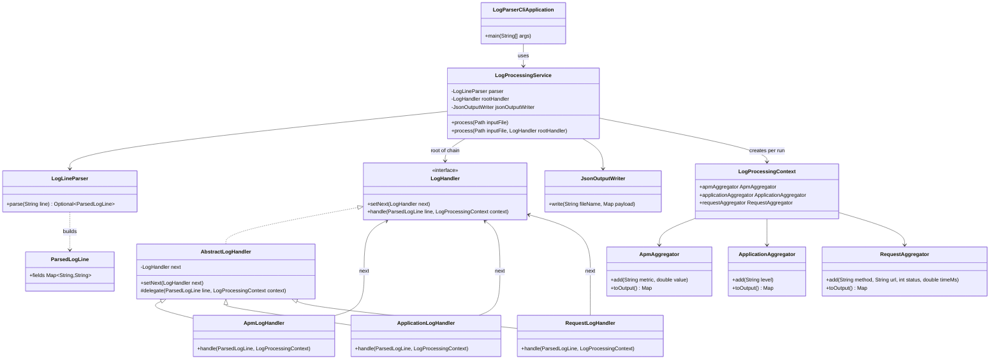

# Part I — Design & Problem Statement

## 1. Describe what problem you’re solving

Real logs rarely come in one uniform shape. In our case we get a plain-text file with one log entry per line, but those lines mix several kinds of information: some look like APM metrics (a `metric` name and a numeric `value`), some like application events (a `level` and a `message`), and some like HTTP requests (`request_method`, `request_url`, `response_status`, `response_time_ms`). None of that is useful until we sort each line into the right bucket.

What we’re building is a small command-line tool that reads that file, figures out which kind of line it is whenever the format matches what we support, and then summarizes the data separately for each kind. The summaries land in three JSON outputs—`apm.json`, `application.json`, and `request.json`—so downstream tools can consume them without caring how we parsed the original file.

Some lines will be malformed or simply not match any of our supported shapes. Those should be skipped quietly; the program should not blow up on bad input. We also want a layout that doesn’t paint us into a corner: if someone adds another log style later, we’d rather extend the design than throw everything away and start over.

---

## 2. What design pattern(s) will be used to solve this?

The main idea for deciding “what kind of line is this?” is **Chain of Responsibility**. After we parse a line into a structured `ParsedLogLine`, we walk it through a fixed sequence of handlers—APM first, then application logs, then request logs. Each handler either recognizes the line and does its job, or passes it along. The last handler in our chain is `RequestLogHandler`; there is nothing after it, so if no handler claimed the line, it simply isn’t counted anywhere. That keeps classification logic out of one giant nested `if` statement.

Alongside that, we’re leaning on **separation of concerns** (same spirit as giving each class a single clear job): parsing lives in one place, routing lines through the chain in another, aggregation in its own types, and writing JSON in another. That way a change to output format doesn’t force us to touch parsing code, and vice versa.

For the actual math and rollups, each log family has its own aggregator object—almost like picking a small strategy per category. APM metrics get min/median/average/max per metric name; application logs get counts by severity; request logs get response-time stats and status buckets per route. So the “how we summarize” part stays flexible per type without duplicating the whole pipeline three times.

---

## 3. Describe the consequences of using this/these pattern(s)

What we gain is mostly about living with the code later. Adding another log type mostly means adding another handler in the right place in the chain and maybe a new aggregator, instead of rewriting a monolithic parser method. Each piece stays small enough that we can unit-test parsing, each handler, each aggregator, and a full file run without stepping on the same code paths every time. Bad lines tend to fail early when parsing breaks; lines that parse but don’t match any handler just fall off the end of the chain and disappear, which matches “ignore what we don’t understand.”

The flip side is real too. More classes means more wiring and more files than a single “parse everything here” class. Order in the chain isn’t cosmetic—if we put a greedy handler too early, it can swallow lines that belonged somewhere else. And Chain of Responsibility doesn’t magically understand every log format in the wild; our parser assumes space-separated `key=value` lines, so something like a standard Apache combined log would need different parsing or an adapter, not just another handler bolted on top.

---

## 4. Class diagram — classes and Chain of Responsibility

The diagram shows the **handler chain** (`LogHandler` implementations), parsing, shared context, aggregators, and JSON output. The same structure appears as a non-graphical outline in `PART1_SUBMISSION.txt` for reference.

**Chain of Responsibility flow:** `LogProcessingService` parses each line to a `ParsedLogLine`, then invokes the **root** handler (`ApmLogHandler`). Each handler either **updates** the appropriate aggregator on `LogProcessingContext` or **delegates** to the next handler. The chain **ends** at `RequestLogHandler` (`HandlerChainConfiguration`): if that handler cannot match, `delegate` runs with **no** next handler, so the line is dropped without aggregation. Finally, **`JsonOutputWriter`** writes aggregator results to `apm.json`, `application.json`, and `request.json`.
